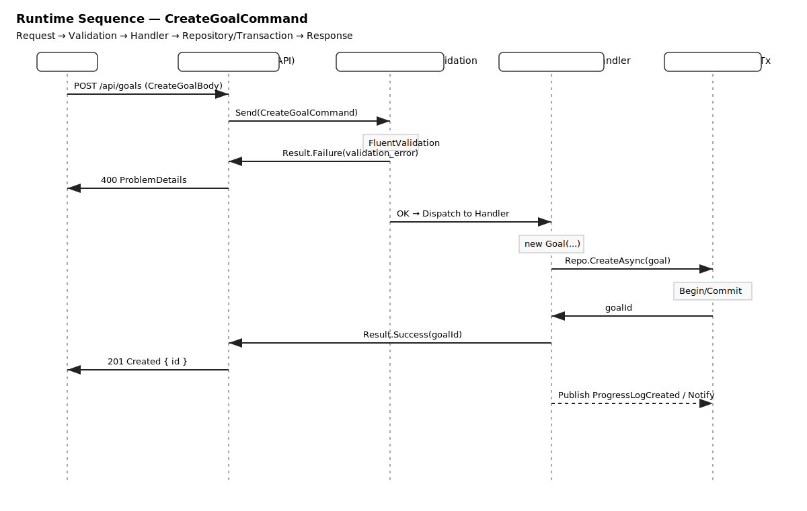

# GoalFlow – Application Layer (Goals Module)

> Teaching-points for interviews & code reviews. Focus: CQRS requests, validation, DTOs, and ownership semantics in `GoalFlow.Application.Goals`.

## Purpose & Scope

The **Goals module** defines **CQRS commands, queries, and DTOs** for managing SMART goals. It expresses user intent (create, update, delete, query) in a decoupled way, with validation applied **before** domain or infrastructure code runs.

This layer is:

- **Infrastructure-independent** (no persistence/IO concerns here)
- **Owner-aware** (every request carries `UserId`)
- **Predictable** (returns `Result<T>`; no control-flow by exceptions)
- **Testable** (pure request/response + FluentValidation)

---

## Key Patterns

- **CQRS + MediatR** → separate write/read flows; handlers remain thin and composable  
- **FluentValidation** → declarative validation at the application boundary  
- **Result<T>** → explicit success/failure without throwing for business cases  
- **DTOs** → API/UI transport models decoupled from domain entities

---

## Commands

### 1) `CreateGoalCommand`

```csharp
public record CreateGoalCommand(
    Guid UserId,
    string Title,
    string Specific,
    string Measurable,
    string Achievable,
    string Relevant,
    DateTimeOffset TimeBound,
    string? Description,
    GoalPriority Priority
) : IRequest<Result<Guid>>;
```

- **Intent**: Create a SMART goal
- **Validator**: SMART fields present, title length bounds, `TimeBound` in the future
- **Return**: `Result<Guid>` (new Goal ID)

---

### 2) `UpdateGoalCommand`

```csharp
public record UpdateGoalCommand(
    Guid Id, Guid UserId,
    string Title, string Specific, string Measurable, string Achievable, string Relevant,
    DateTimeOffset TimeBound, string? Description, string Priority, string Status
) : IRequest<Result<bool>>;
```

- **Intent**: Update an existing goal
- **Validator**: `Id`, `UserId`, non-empty `Title`, valid `Priority` & `Status`
- **Return**: `Result<bool>` (success flag)

---

### 3) `DeleteGoalCommand`

```csharp
public record DeleteGoalCommand(Guid Id, Guid UserId) : IRequest<Result<bool>>;
```

- **Intent**: Delete a goal owned by the user
- **Return**: `Result<bool>`

---

### 4) `CreateProgressLogCommand`

```csharp
public record CreateProgressLogCommand(
    Guid GoalId, Guid UserID, int Delta, string? Note
) : IRequest<Result<Guid>>;
```

- **Intent**: Record progress (+/- effort units) against a goal
- **Validator**: Valid IDs, `Delta` in [-100, 100], `Note` max length (e.g., 500)
- **Return**: `Result<Guid>` (new log ID)

---

### 5) `CreateReminderCommand`

```csharp
public record CreateReminderCommand(
    Guid GoalId, ReminderChannel Channel, string CronExpr
) : IRequest<Result<Guid>>;
```

- **Intent**: Attach a CRON-based reminder (Email/Push) to a goal
- **Validator**: Non-empty CRON, valid IDs
- **Return**: `Result<Guid>` (reminder ID)

---

## Queries

### 1) `GetGoalByIdQuery`

```csharp
public record GetGoalByIdQuery(Guid Id, Guid UserId) : IRequest<GoalDetailDto?>;
```

- **Intent**: Fetch full details of one goal
- **DTO**: `GoalDetailDto` (title, SMART fields, priority, status, deadline, createdAt)
- **Ownership**: Enforced via `UserId`

---

### 2) `GetGoalsQuery` (Paginated)

```csharp
public record GetGoalsQuery(
    Guid UserId,
    int Page = 1,
    int PageSize = 20,
    string? Search = null,
    string? Status = null,
    string? Priority = null
) : IRequest<PagedResult<GoalSummaryDto>>;
```

- **Intent**: List a user’s goals with filters
- **DTO**: `GoalSummaryDto` (lightweight listings)
- **Filters**: `Search`, `Status`, `Priority`
- **Wrapper**: `PagedResult<T>` (items + page metadata)

---

### 3) `GetProgressLogsQuery`

```csharp
public record GetProgressLogsQuery(
    Guid GoalId, int Page = 1, int PageSize = 50
) : IRequest<IReadOnlyList<ProgressLogDto>>;
```

- **Intent**: Paginated logs for a specific goal
- **DTO**: `ProgressLogDto` (delta, note, createdAt)

---

## Events (Notifications)

### `ProgressLogCreated`

```csharp
public record ProgressLogCreated(
    Guid Id, Guid GoalId, int Delta, string? Note, DateTimeOffset CreatedAt
) : INotification;
```

- **Intent**: Fire-and-forget when a progress log is created
- **Typical handlers**: Analytics, streaks, reminder recalculation

---

## DTOs (Overview)

- **`GoalSummaryDto`** → id, title, priority, status, key dates (for lists)
- **`GoalDetailDto`** → full SMART content, priority/status, timestamps
- **`ProgressLogDto`** → delta, note, timestamps
- **Wrappers**: `Result<T>`, `PagedResult<T>`

> DTOs keep the API/UI contract stable even if domain changes.

---

## Validation (Teaching Points)

- Keep validation **close to the boundary** (command/query validators)
- Prefer **small, focused rules** (title length, enums, future dates)
- Return **structured failures** via `Result<T>` (no exception control-flow)
- Validate **ownership inputs** (`UserId`) up front

---

## Ownership & Security

- Every command/query carries `UserId`
- Handlers consistently check ownership (often combined later with API policies)
- Prevents cross-tenant access before touching domain/infrastructure

---

## Why This Design?

- **CQRS clarity**: Writes don’t return data; reads don’t change state  
- **MediatR decoupling**: Handlers are swappable, testable, and pipeline-friendly  
- **Result-first flow**: Happy-path and failure are equally explicit  
- **Stable contracts**: DTOs shield UI/API from domain shape

---

## Example Handler Skeletons (Illustrative)

```csharp
public sealed class CreateGoalHandler
    : IRequestHandler<CreateGoalCommand, Result<Guid>>
{
    public async Task<Result<Guid>> Handle(
        CreateGoalCommand cmd, CancellationToken ct)
    {
        // validate business invariants beyond FluentValidation if needed
        // map to domain entity (in Infrastructure or via factory)
        // persist via repository (Infrastructure)
        // return Result.Success(newId) or Result.Failure(errors)
        throw new NotImplementedException();
    }
}
```

```csharp
public sealed class GetGoalsHandler
    : IRequestHandler<GetGoalsQuery, PagedResult<GoalSummaryDto>>
{
    public async Task<PagedResult<GoalSummaryDto>> Handle(
        GetGoalsQuery q, CancellationToken ct)
    {
        // apply filters (search/status/priority), paging, projection to DTO
        // return PagedResult<GoalSummaryDto>
        throw new NotImplementedException();
    }
}
```

> Handlers stay thin; orchestration and projection happen here, not IO or controllers.

---

## Testability Notes

- **Unit test** validators independently (edge cases, enum bounds, date rules)
- **Handler tests** using in-memory fakes for repositories/projections
- Assert on **`Result<T>`** content (success flag, error codes/messages)

---

## Quick Folder Sketch

```
Application/
  Goals/
    Commands/
      CreateGoal/
      UpdateGoal/
      DeleteGoal/
      CreateProgressLog/
      CreateReminder/
    Queries/
      GetGoalById/
      GetGoals/
      GetProgressLogs/
    Dtos/
      GoalSummaryDto.cs
      GoalDetailDto.cs
      ProgressLogDto.cs
    Events/
      ProgressLogCreated.cs
```

---

## Takeaway

With this module, **GoalFlow.Application.Goals** demonstrates a complete, interview-ready **CQRS** slice:
CRUD + pagination, strong validation, ownership, events, and clear DTO boundaries—clean to read, easy to test, and safe to evolve.

---
## CQRS Flow – CreateGoalCommand


## Runtime Sequence — CreateGoalCommand




