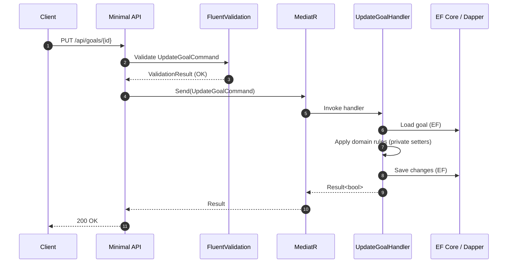

# GoalFlow

A modern, interview‑ready **.NET SaaS** sample for **SMART goal management** showcasing clean architecture (Domain / Application / Infrastructure / API), **CQRS with MediatR**, **EF Core + Dapper**, **JWT auth (access + refresh)**, **ownership authorization**, **rate limiting + ProblemDetails**, **Serilog**, **SignalR** for real‑time updates, **Redis caching**, and **Hangfire** for reminders.

> Built to be readable, teachable, and production‑lean — use it as a code sample or grow it into an MVP.

---

## Table of Contents
- [Architecture](#architecture)
- [Key Features](#key-features)
- [Tech Stack](#tech-stack)
- [Solution Layout](#solution-layout)
- [Getting Started](#getting-started)
- [Configuration](#configuration)
- [Runtime Flow (CQRS)](#runtime-flow-cqrs)
- [API Surface (v1)](#api-surface-v1)
- [Background Jobs & Reminders](#background-jobs--reminders)
- [Caching Strategy](#caching-strategy)
- [Error Handling](#error-handling)
- [Logging & Observability](#logging--observability)
- [Security Notes](#security-notes)
- [Development Tips](#development-tips)
- [Roadmap / MVP Checklist](#roadmap--mvp-checklist)
- [Architecture Decisions (ADR)](#architecture-decisions-adr)
- [License](#license)

---

## Architecture

**Clean, layered design**:

```
GoalFlow.Domain          // Entities, value objects, domain rules
GoalFlow.Application     // CQRS (Commands/Queries), DTOs, validators, policies
GoalFlow.Infrastructure  // EF Core, Dapper, Redis, Hangfire, Sql plumbing
GoalFlow.Api             // Minimal APIs, JWT auth, Swagger, SignalR, wiring
```

**Principles**
- **Separation of concerns**: API is thin; all logic lives in Application.
- **CQRS**: Write via commands, read via queries (Dapper preferred for reads).
- **Explicit ownership**: Policies ensure users can only access their own data.
- **Predictable responses**: `Result<T>` pattern instead of throwing across layers.
- **Testable**: Validators and handlers are easy to unit test.

> **Note**: Each layer includes a dedicated `README.md` and the repo includes ADRs for key trade‑offs.

---

## Key Features
- **SMART Goals** CRUD with priority, description, and time‑bound metadata.
- **Authentication**: JWT (HMAC‑SHA256), short‑lived access + refresh rotation.
- **Authorization**: Owner‑only access enforced by policy/handler.
- **Real‑time**: SignalR hub broadcasts goal updates to connected clients.
- **Reminders**: Hangfire jobs (cron‑based) to send email/push (extensible).
- **Caching**: Redis for query caching and token/instance coordination.
- **DX**: Swagger UI, ProblemDetails, Serilog enriched logs, rate limiting.

---

## Tech Stack
- **Runtime**: .NET (Minimal APIs), C#
- **Data**: SQL Server (EF Core Migrations), Dapper for fast reads
- **Auth**: JWT bearer (access/refresh), ASP.NET Core Identity (optional)
- **Background**: Hangfire (SQL storage)
- **Cache**: Redis (StackExchange.Redis)
- **Realtime**: SignalR
- **Validation**: FluentValidation
- **Logging**: Serilog (+ OpenTelemetry enrichment ready)

---

## Solution Layout

```
/GoalFlow.sln
/src
  /GoalFlow.Domain
  /GoalFlow.Application
  /GoalFlow.Infrastructure
  /GoalFlow.Api
/docs
  Application.Goals.md
  Api.TeachingPoint.md
  Infrastructure.README.md
  ADR-0001-jwt-refresh-rotation.md
  ADR-0002-ownership-policy.md
```

---

## Getting Started

### Prerequisites
- .NET SDK (latest LTS)
- SQL Server (local or container)
- Redis (local or container)
- (Optional) Docker/Docker Compose

### Quick Start (Local)
1. **Clone** & open the solution.
2. **Configure** connection strings & JWT (see [Configuration](#configuration)).
3. **Apply migrations**:
   ```bash
   dotnet ef database update -p src/GoalFlow.Infrastructure -s src/GoalFlow.Api
   ```
4. **Run API**:
   ```bash
   dotnet run --project src/GoalFlow.Api
   ```
5. Browse **Swagger** at `https://localhost:5001/swagger` (or displayed port).

### Using Docker (SQL + Redis)
Minimal `docker-compose.yml` example:
```yaml
version: '3.9'
services:
  sql:
    image: mcr.microsoft.com/mssql/server:2022-latest
    environment:
      - ACCEPT_EULA=Y
      - SA_PASSWORD=Your_strong_password123!
    ports: ["1433:1433"]
    healthcheck:
      test: ["CMD-SHELL", "/opt/mssql-tools/bin/sqlcmd -S localhost -U sa -P Your_strong_password123! -Q 'SELECT 1' || exit 1"]
      interval: 10s
      retries: 10
  redis:
    image: redis:7-alpine
    ports: ["6379:6379"]
```
Set env vars to point to these services (see below), then run `docker compose up -d`.

---

## Configuration

All settings are read from `appsettings.json` + environment variables.

**Required keys** (typical):
```json
{
  "ConnectionStrings": {
    "Sql": "Server=localhost,1433;Database=GoalFlow;User Id=sa;Password=Your_strong_password123!;TrustServerCertificate=True"
  },
  "Redis": {
    "Connection": "localhost:6379"
  },
  "Jwt": {
    "Issuer": "goalflow.local",
    "Audience": "goalflow.web",
    "Key": "a-very-long-random-256-bit-secret",
    "AccessTokenMinutes": 15,
    "RefreshTokenDays": 7
  },
  "Hangfire": {
    "WorkerCount": 2
  }
}
```
Common ASP.NET keys:
- `ASPNETCORE_ENVIRONMENT=Development|Staging|Production`
- `Serilog__MinimumLevel__Default=Information`

> **Security**: store secrets outside source control (User Secrets, env vars, Azure Key Vault, etc.).

---

## Runtime Flow (CQRS)

**End‑to‑end path for Update Goal** (request → response):



> In reads, queries often go through **Dapper** for speed and simple mapping.

---

## API Surface (v1)

### Auth
- `POST /api/auth/login` → `{ accessToken, refreshToken }`
- `POST /api/auth/refresh` → rotates pair, invalidates previous refresh

### Goals
- `GET /api/goals` → paged list (owner‑scoped)
- `GET /api/goals/{id}` → details (owner‑scoped)
- `POST /api/goals` → create
- `PUT /api/goals/{id}` → update
- `DELETE /api/goals/{id}` → soft delete (optional)

### Reminders
- `GET /api/goals/{id}/reminders`
- `POST /api/goals/{id}/reminders` → `{ channel, cronExpr }`
- `PUT /api/reminders/{id}` → update/activate/deactivate

### Debug / Utilities
- `GET /_debug/claims` → current JWT claims (dev only)

**Conventions**
- **Auth required** for all business endpoints (Bearer).
- **Ownership policy** checks `{id}`/`UserId` mapping.
- **ProblemDetails** for errors; 429 via **RateLimiting**.

**Example: Create a goal**
```bash
curl -X POST https://localhost:5001/api/goals \
  -H "Authorization: Bearer $ACCESS_TOKEN" \
  -H "Content-Type: application/json" \
  -d '{
    "title":"Ship MVP",
    "specific":"Define scope & cut nice-to-haves",
    "measurable":"MVP deployed",
    "achievable":"2 sprints",
    "relevant":"Interview portfolio",
    "timeBound":"2025-10-31T00:00:00Z",
    "description":"Focus on core flows",
    "priority":"High"
  }'
```

---

## Background Jobs & Reminders
- **Hangfire** uses SQL storage; dashboard can be enabled in dev.
- `Reminder` domain entity supports `channel`, `cronExpr`, and `nextRun`.
- Infrastructure schedules jobs per reminder; handlers send via email/push.

> Tip: Isolate I/O with adapters so channels (Email/Push/SMS) swap cleanly.

---

## Caching Strategy
- **Redis** as a distributed cache and for lightweight coordination.
- Cache **read models** (queries). Invalidate on relevant command success.
- Keys are namespaced per user to respect ownership boundaries.

---

## Error Handling
- **Hellang ProblemDetails** middleware maps exceptions → RFC7807.
- Validation errors return `400` with field details.
- Unauthorized → `401`; Forbidden → `403`; Not found → `404`; Throttled → `429`.

---

## Logging & Observability
- **Serilog** with enrichers (Span/Correlation) → console/file/sink.
- Correlate API → handler → DB using request ids and operation names.
- OpenTelemetry exporters can be added without code churn.

---

## Security Notes
- Short‑lived **access tokens** (default: 15 min).
- **Refresh token rotation**; store only the **hash** server‑side.
- All business endpoints require **Bearer** and pass **ownership** checks.
- Use **HTTPS** everywhere; enable **HSTS** in production.

---

## Development Tips
- Keep **handlers thin**; extract domain logic into entities/services.
- Prefer **Dapper** for list/details queries; map to DTOs.
- EF Core for writes/aggregates and migrations.
- Avoid exposing domain entities over the wire — use DTOs.
- Keep validators close to their command/query types.

---

## Roadmap / MVP Checklist
- [x] Goals CRUD (CQRS + validation + ownership)
- [x] JWT auth (login/refresh) + rate limiting + ProblemDetails
- [x] Redis caching for read models
- [x] SignalR broadcasts on goal changes
- [x] Hangfire reminders (cron)
- [ ] Email/Push adapters with real providers (SendGrid/FCM)
- [ ] E2E tests (API + handlers)
- [ ] Dockerfiles + CI (build/test) + CD (optional)
- [ ] Frontend sample (React/Next.js) consuming the API & SignalR

---

## Architecture Decisions (ADR)
See `/docs` for concise decisions:
- **ADR‑0001**: JWT access/refresh rotation with hashed refresh store.
- **ADR‑0002**: Owner‑only authorization policy design.
- **ADR‑0003**: Reads via Dapper, writes via EF Core.

> Each ADR includes context, options considered, decision, and consequences.

---

## License
MIT.

